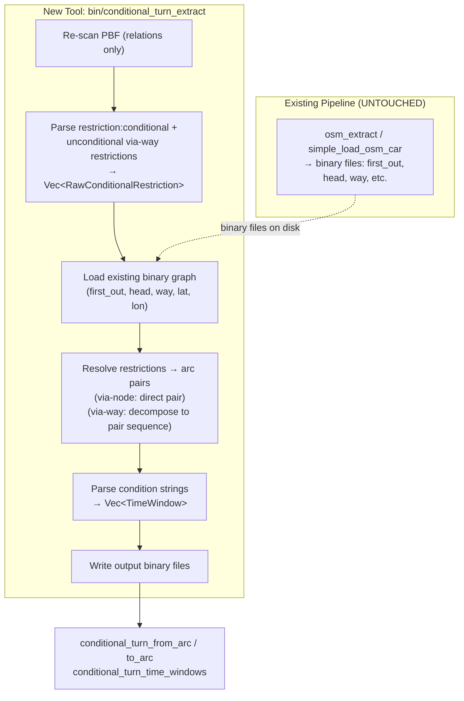

# Conditional Turn Restrictions — Modular Addition to RoutingKit

## Motivation

RoutingKit's `decode_osm_car_turn_restrictions` only reads `tags["restriction"]` — it completely ignores `restriction:conditional` and all vehicle-type variants (`restriction:hgv`, etc.). It also silently drops all **via-way** restrictions (where the `via` member is a way rather than a node). The engine's CCH and query layers have no concept of time-varying or path-based forbidden turns.

This plan adds extraction of both conditional and via-way turn restrictions as **new files within the RoutingKit repo** — following its existing conventions — while not editing any existing source file. Since no original code is modified, the new component can be cleanly removed by deleting the new files and re-running `generate_make_file`.

## Design Principles

1. **Zero modification to existing source files** — no edits to `osm_graph_builder.cpp`, `osm_profile.cpp`, `osm_simple.cpp`, `osm_extract.cpp`, or any Rust source.
2. **Part of the RoutingKit library build** — new headers in `include/routingkit/`, new library sources in `src/`. Re-running `generate_make_file` auto-discovers the new files and incorporates them into the `Makefile`. Library `.cpp` files (no `main()`) are compiled into `libroutingkit.a`/`.so`; the tool `.cpp` (with `main()`) becomes `bin/conditional_turn_extract`.
3. **Output compatible with RoutingKit's `(from_arc, to_arc)` convention** — all output is expressed as sorted parallel `from_arc` / `to_arc` vectors (`Vec<u32>`), the same format that `forbidden_turn_from_arc` / `forbidden_turn_to_arc` use. This means the existing `line_graph()` callback in `rust_road_router` and the sorted peekable-iterator consumption pattern in `turn_expand_osm.rs` work without modification.
4. **Post-hoc resolution** — the tool runs **after** the standard graph extraction has already produced binary files (`first_out`, `head`, `way`, `latitude`, `longitude`, etc.). It reads those files plus the original PBF to produce additional output.
5. **Output-only** — the conditional turn data is written as new binary files alongside the existing graph. Downstream consumers opt in by loading these files; consumers that don't need conditional turns are unaffected.

## Scope

> [!IMPORTANT]
> **Phase 1 — Time/date-based conditions + via-way restrictions**:
> - Conditional turn restrictions with time/date conditions (e.g. `no_right_turn @ (Mo-Fr 07:00-09:00)`)
> - Via-way restrictions (both unconditional and conditional), where the `via` member is a way rather than a node
>
> **Deferred to later phases**:
> - Vehicle-property conditions (weight, height, axle load)
> - Compound conditions (time + vehicle)
> - Public holiday (`PH`) conditions
> - Multi-via-way chains (restrictions with more than one via-way)

---

## Compatibility Contract with RoutingKit Output Format

The existing RoutingKit → rust_road_router pipeline consumes forbidden turns in a very specific way. Our output **must** be compatible with this contract, or downstream phases will break.

### How the existing pipeline consumes forbidden turns

1. **Binary format**: `forbidden_turn_from_arc` and `forbidden_turn_to_arc` are `Vec<u32>`, sorted by `(from_arc, to_arc)`, written as raw binary via `save_vector()`.

2. **`line_graph()` callback** (`engine/src/datastr/graph.rs`): Takes `(EdgeId, EdgeId) -> Option<Weight>`. For each arc `e1` and each outgoing arc `e2` from `e1`'s head, calls the callback. `None` = forbidden (no edge in line graph), `Some(cost)` = allowed with turn cost.

3. **`turn_expand_osm.rs` consumption pattern**: Loads the sorted `(from_arc, to_arc)` pairs and zips them into a **peekable iterator**. During `line_graph()`, the callback advances the iterator in lockstep with the sorted `(e1, e2)` enumeration:

   ```rust
   let mut iter = forbidden_turn_from_arc.iter().zip(forbidden_turn_to_arc.iter()).peekable();
   
   let exp_graph = line_graph(&graph, |edge1_idx, edge2_idx| {
       // Advance past any pairs we've already passed
       while let Some((&from_arc, &to_arc)) = iter.peek() {
           if from_arc < edge1_idx || (from_arc == edge1_idx && to_arc < edge2_idx) {
               iter.next();
           } else { break; }
       }
       // Check if current pair is forbidden
       if iter.peek() == Some(&(&edge1_idx, &edge2_idx)) {
           return None;  // forbidden
       }
       // U-turn check
       if tail[edge1_idx as usize] == graph.head()[edge2_idx as usize] {
           return None;
       }
       Some(0)
   });
   ```

4. **Key invariant**: The pairs must be **sorted by `(from_arc, to_arc)`** in the same order that `line_graph()` enumerates `(e1, e2)` transitions. The `line_graph()` function iterates arcs 0..N and for each arc iterates its head's outgoing arcs in `first_out` order — this produces `(e1, e2)` pairs sorted first by `e1`, then by `e2` within each `e1`.

### What our output must satisfy

| Requirement | Rationale |
|---|---|
| `from_arc` and `to_arc` are `Vec<u32>`, same length | Matches `forbidden_turn_from_arc` / `forbidden_turn_to_arc` |
| Sorted by `(from_arc, to_arc)` ascending | Required by the peekable-iterator pattern |
| Each `(from_arc, to_arc)` represents a single arc-to-arc transition at one shared node | The `line_graph()` callback sees one transition at a time |
| Values are valid arc indices in the original graph | Must index into `head[]`, `tail[]`, etc. |
| Written via `save_vector()` (raw binary, no header) | Must be loadable by `Vec::<EdgeId>::load_from()` on the Rust side |

> [!IMPORTANT]
> **This means via-way restrictions must be decomposed into `(from_arc, to_arc)` pairs.** We cannot output arc sequences directly — the downstream `line_graph()` callback and the peekable-iterator pattern only understand pairs.

---

## Architecture



The tool is a single new C++ binary (`bin/conditional_turn_extract`) that:
1. Reads the **already-extracted** graph from binary files (it does not re-extract the graph).
2. Re-scans the PBF file for relations with `restriction:conditional` tags **and** unconditional restrictions with via-way members (which RoutingKit currently drops).
3. Resolves the raw restrictions into arc-pair + condition triples.
4. Writes output binary files in the RoutingKit-compatible format.

---

## New Files Within RoutingKit

All new files follow RoutingKit's existing layout conventions. None replace or modify existing files.

| New File | Purpose |
|---|---|
| `include/routingkit/osm_condition_parser.h` | Time-condition data structures and parser declaration |
| `include/routingkit/conditional_restriction_decoder.h` | Raw conditional restriction struct + decoder declaration |
| `include/routingkit/conditional_restriction_resolver.h` | Resolver declaration |
| `src/osm_condition_parser.cpp` | Parses `Mo-Fr 07:00-09:00` format into `TimeWindow` structs |
| `src/conditional_restriction_decoder.cpp` | Reads `restriction:conditional` and via-way restriction tags from PBF relations |
| `src/conditional_restriction_resolver.cpp` | Maps raw restrictions to arc pairs using the existing graph |
| `src/conditional_turn_extract.cpp` | Main CLI tool — orchestrates the pipeline (contains `main()`) |

### Directory layout (showing only new files)

```
RoutingKit/
├── Makefile                  # REGENERATED by generate_make_file (picks up new files)
├── generate_make_file        # UNTOUCHED
├── include/routingkit/
│   ├── osm_condition_parser.h              # NEW
│   ├── conditional_restriction_decoder.h   # NEW
│   ├── conditional_restriction_resolver.h  # NEW
│   └── ... (existing headers untouched)
├── src/
│   ├── osm_condition_parser.cpp              # NEW (library — no main())
│   ├── conditional_restriction_decoder.cpp   # NEW (library — no main())
│   ├── conditional_restriction_resolver.cpp  # NEW (library — no main())
│   ├── conditional_turn_extract.cpp          # NEW (tool — has main())
│   └── ... (existing sources untouched)
├── build/   # object files
├── bin/
│   ├── conditional_turn_extract   # NEW binary (auto-discovered)
│   └── ... (existing binaries)
└── lib/
    ├── libroutingkit.a   # Now also contains the 3 new library .o files
    └── libroutingkit.so  # Same
```

### How `generate_make_file` handles this

RoutingKit's `generate_make_file` script auto-discovers files:
- All `.cpp` files in `src/` are compiled to `.o` in `build/`.
- Files containing `int main(...)` become `bin/` targets.
- Files **without** `main()` become part of `libroutingkit.a` / `libroutingkit.so`.
- Header dependencies in `include/routingkit/` are resolved automatically via `#include` scanning.

So adding our files and re-running the script is all it takes:

```bash
cd RoutingKit
./generate_make_file    # regenerates Makefile, discovers new files
make                    # builds everything including the new tool
```

### Removal

```bash
rm include/routingkit/osm_condition_parser.h
rm include/routingkit/conditional_restriction_decoder.h
rm include/routingkit/conditional_restriction_resolver.h
rm src/osm_condition_parser.cpp
rm src/conditional_restriction_decoder.cpp
rm src/conditional_restriction_resolver.cpp
rm src/conditional_turn_extract.cpp
./generate_make_file    # regenerates Makefile without the deleted files
make clean && make      # rebuild
```

---

## Component Details

### 1. Condition Parser (`osm_condition_parser.h/.cpp`)

Parses OSM opening-hours-style time conditions into a structured format.

```cpp
namespace RoutingKit {

struct TimeWindow {
    uint8_t day_mask;           // bit 0=Mo, bit 1=Tu, ..., bit 6=Su. 0x7F = all days
    uint16_t start_minutes;     // minutes since midnight, 0–1440
    uint16_t end_minutes;       // minutes since midnight, 0–1440 (end > 1440 means wraps midnight)
};

struct ParsedCondition {
    std::string restriction_value;              // e.g. "no_right_turn"
    std::vector<TimeWindow> time_windows;       // when the restriction is active
};

// Parses "no_right_turn @ (Mo-Fr 07:00-09:00; Sa 10:00-14:00)" 
// into restriction_value + vector of TimeWindows.
// Returns empty vector on parse failure.
std::vector<ParsedCondition> parse_conditional_value(const char* conditional_value);

// Evaluates whether any time window is active at the given time.
bool is_time_window_active(
    const std::vector<TimeWindow>& windows,
    unsigned day_of_week,           // 0=Mon, 6=Sun
    unsigned minutes_since_midnight // 0–1439
);

} // RoutingKit
```

**OSM `restriction:conditional` format reference:**

```
restriction:conditional = no_right_turn @ (Mo-Fr 07:00-09:00)
restriction:conditional = no_left_turn @ (Mo-Fr 07:00-09:00,16:00-18:00)
restriction:conditional = only_straight_on @ (Sa,Su)
restriction:conditional = no_right_turn @ (06:00-22:00)
```

The parser must handle:
- Day ranges: `Mo-Fr`, `Mo-Su`, individual days `Sa,Su`
- Time ranges: `07:00-09:00`, multiple ranges `07:00-09:00,16:00-18:00`
- Time-only (no day): applies to all days
- Multiple conditions separated by `;`
- Public holiday (`PH`) — deferred to Phase 2, logged as unsupported

### 2. Conditional Restriction Decoder (`conditional_restriction_decoder.h/.cpp`)

Reads `restriction:conditional` tags **and** unconditional via-way restrictions from OSM relations.

```cpp
namespace RoutingKit {

struct RawConditionalRestriction {
    uint64_t osm_relation_id;
    
    // Reuses existing RoutingKit enums (from osm_graph_builder.h)
    OSMTurnRestrictionCategory category;
    OSMTurnDirection direction;
    
    // OSM IDs (global, not yet mapped to local)
    uint64_t from_way;
    uint64_t to_way;
    
    // Via member — exactly one of these is used:
    uint64_t via_node;              // (uint64_t)-1 if absent or if via is a way
    std::vector<uint64_t> via_ways; // empty if via is a node; one or more way IDs if via is a way
    
    // Condition string, e.g. "Mo-Fr 07:00-09:00". Empty for unconditional restrictions.
    std::string condition_string;
};

// Scans a PBF file for:
//   1. Relations with restriction:conditional (or restriction:motorcar:conditional) tags
//   2. Relations with unconditional restriction tags where the via member is a way
//      (these are currently silently dropped by RoutingKit's decoder)
// Calls on_restriction for each parsed restriction.
void scan_conditional_restrictions_from_pbf(
    const std::string& pbf_file,
    std::function<void(RawConditionalRestriction)> on_restriction,
    std::function<void(const std::string&)> log_message = nullptr
);

} // RoutingKit
```

**Tag reading logic:**

For each relation:

1. **Conditional restrictions**: check `tags["restriction:conditional"]`. If absent, check `tags["restriction:motorcar:conditional"]`. If found:
   - Parse the value as `<restriction_value> @ (<condition>)`.
   - Determine `category` from `only_`/`no_` prefix, `direction` from suffix.
   - Parse member roles. Accept `via` as either node or way.
   - Emit `RawConditionalRestriction` with the condition string.

2. **Unconditional via-way restrictions**: check `tags["restriction"]`. If found:
   - Check if the `via` member is a way (not a node). If so, this is a restriction that RoutingKit's existing decoder would silently drop.
   - Parse the restriction value and direction using the same logic.
   - Emit `RawConditionalRestriction` with an **empty** `condition_string` (meaning always active / unconditional).

3. **Skip** if neither tag is present, or if both are present and the unconditional `restriction` has a via-node (since RoutingKit's existing decoder already handles those).

**Member role parsing:**
- `from` must be a way.
- `to` must be a way.
- `via` may be a **node** (same as existing decoder) or a **way** (new capability).
- `via` as a **relation** → skip.
- Multiple `via` ways → stored in order in `via_ways` (Phase 1 supports single via-way only; multi-via-way is deferred but the struct can hold them).
- Multiple `from`/`to` for mandatory restrictions → skip.

### 3. Conditional Restriction Resolver (`conditional_restriction_resolver.h/.cpp`)

Takes raw restrictions (with OSM global IDs) and the already-built graph (loaded from binary files), and produces resolved arc-pair + condition triples.

```cpp
namespace RoutingKit {

struct ResolvedConditionalTurns {
    std::vector<unsigned> from_arc;         // parallel arrays, sorted by (from_arc, to_arc)
    std::vector<unsigned> to_arc;           // same length as from_arc
    std::vector<std::string> condition;     // same length; empty string = unconditional (always active)
};

// Loads the existing graph from binary files and resolves restrictions.
ResolvedConditionalTurns resolve_conditional_restrictions(
    const std::string& graph_dir,
    const std::string& pbf_file,
    const std::vector<RawConditionalRestriction>& raw_restrictions,
    std::function<void(const std::string&)> log_message = nullptr
);

} // RoutingKit
```

**Resolution pipeline:**

1. **Rebuild ID mappings**: Re-run `load_osm_id_mapping_from_pbf` with the car profile to obtain BitVectors, then construct `IDMapper` objects.
2. **Map OSM IDs → local IDs**: Convert `from_way`, `to_way`, `via_node`, and `via_ways[]` using the IDMappers. Drop restrictions with non-routing ways/nodes.
3. **Load graph from binary files**: Read `first_out`, `head`, `way`, `latitude`, `longitude` using `load_vector<T>`.
4. **Resolve via-node restrictions** (same logic as existing `osm_graph_builder.cpp` Stages 2–3):
   - Infer missing via-nodes.
   - Disambiguate with angles.
   - Output: one `(from_arc, to_arc)` pair per restriction.
5. **Resolve via-way restrictions** (new logic — see section below).
6. **Sort and deduplicate**: Sort by `(from_arc, to_arc)`, remove exact duplicates.
7. **Output**: Three parallel vectors.

#### Via-Way Restriction Resolution — Decomposition into Arc Pairs

A via-way restriction says: "it is forbidden to go from `from_way`, through `via_way`, onto `to_way`." In the graph, this is a path of arcs:

```
from_arc → via_arc(s) → to_arc
         ↑            ↑
     junction A    junction B
```

Where junction A is the node shared by `from_way` and `via_way`, and junction B is the node shared by `via_way` and `to_way`.

**Step 1 — Find junction nodes:**

- Junction A: find the node where `from_way` and `via_way` share a routing node (same logic as the existing via-node inference — find where way node sets intersect).
- Junction B: find the node where `via_way` and `to_way` share a routing node.
- If either has 0 or 2+ candidates → drop the restriction (log warning).

**Step 2 — Find arc candidates at each junction:**

- At junction A: find the inbound `from_arc` (arc on `from_way` whose head is junction A) and the outbound `via_entry_arc` (arc on `via_way` whose tail is junction A).
- At junction B: find the inbound `via_exit_arc` (arc on `via_way` whose head is junction B) and the outbound `to_arc` (arc on `to_way` whose tail is junction B).
- Use angle disambiguation if multiple candidates exist (same as existing logic).

**Step 3 — Decompose into `(from_arc, to_arc)` pairs:**

The forbidden path is `from_arc → via_entry_arc → ... → via_exit_arc → to_arc`. This consists of (at least) two turn pairs:
- Turn 1: `(from_arc, via_entry_arc)` at junction A
- Turn 2: `(via_exit_arc, to_arc)` at junction B

However, we **cannot blindly forbid both pairs independently** — that would be overly aggressive. Forbidding `(from_arc, via_entry_arc)` would block vehicles coming from `from_way` and entering `via_way` for *any* destination, not just `to_way`. Similarly, forbidding `(via_exit_arc, to_arc)` would block vehicles coming from *any* origin on `via_way` and turning onto `to_way`.

**The correct approach depends on the downstream consumption strategy:**

#### Approach for Strategy A/C (Line Graph Rebuild)

In the **line graph**, arcs become nodes and turns become edges. The forbidden via-way path `from_arc → via_entry_arc → ... → via_exit_arc → to_arc` corresponds to a **path of edges** in the line graph. The restriction says this specific path is forbidden, but each individual edge in the path may be fine when used as part of a different path.

For a **single via-way** (the common case), the forbidden path decomposes to 2 turns:
- line graph edge `(from_arc → via_entry_arc)` at junction A
- line graph edge `(via_exit_arc → to_arc)` at junction B

If the via-way has only one arc between A and B (i.e. `via_entry_arc == via_exit_arc`), then there's one intermediate line-graph node, and we need to forbid a **2-edge path** through it. If the via-way has multiple arcs (a chain), there are multiple intermediate nodes.

**To handle this with `(from_arc, to_arc)` pairs, we output the pairs and tag them as part of a sequence.** The output files carry an additional **sequence ID** so the downstream consumer knows which pairs form a single multi-hop restriction:

However, this would break the output format compatibility. So instead:

#### Approach for Strategy B (Penalty at Customization — Recommended)

For the **penalty-based** approach at CCH customization, the decomposition into independent `(from_arc, to_arc)` pairs with **conservative penalties** is both correct and compatible:

- **Prohibitive (`no_*`) via-way restriction**: We output **both** turn pairs `(from_arc, via_entry_arc)` and `(via_exit_arc, to_arc)` as separate entries. At customization time, a penalty is applied to each pair. This is slightly overly aggressive — it penalizes `from_arc → via_entry_arc` even when the vehicle will later exit onto a different way — but this is **safe** (routes still exist, just penalized). The penalty can be tuned to be large but not infinite.

- **Mandatory (`only_*`) via-way restriction**: These are rare for via-way. When they occur, they are expanded the same way as the existing code: at each junction, forbid all outgoing arcs except the continuation onto the mandatory path.

This approach:
- Produces standard `(from_arc, to_arc)` pairs — fully compatible with the existing format.
- Is **conservative** (may over-penalize, never under-penalize) — safe for routing correctness.
- Works with the sorted peekable-iterator consumption pattern unchanged.

> [!IMPORTANT]
> **Format compatibility summary**: Via-way restrictions are decomposed into standard `(from_arc, to_arc)` pairs. The output files have the exact same format as RoutingKit's `forbidden_turn_from_arc` / `forbidden_turn_to_arc`. No new binary file format is needed for via-way support. The `condition_string` is empty for unconditional via-way restrictions and non-empty for conditional ones.

**Over-penalization analysis:**

The over-penalization from decomposing via-way restrictions into independent pairs is bounded:
- It only affects the specific `(from_arc, via_entry_arc)` and `(via_exit_arc, to_arc)` turn pairs.
- In practice, the via-way is typically a short connecting segment (dual carriageway crossing, slip road) where the entry arc and exit arc have very few other connection options — often only one. In these cases, the decomposition is **exact** (no over-penalization).
- When there is over-penalization (the via-way has multiple destinations), the router will find a slightly longer but still valid alternative. This is the same tradeoff made by other routing engines that don't support via-way restrictions at all.

---

### 4. Main Tool (`conditional_turn_extract.cpp`)

```cpp
// Usage:
//   conditional_turn_extract <pbf_file> <graph_dir> [<output_dir>]
//
// If output_dir is omitted, writes to graph_dir (alongside existing files).
//
// Reads:
//   <pbf_file>               — original .osm.pbf file
//   <graph_dir>/first_out    — existing graph binary files
//   <graph_dir>/head
//   <graph_dir>/way
//   <graph_dir>/latitude
//   <graph_dir>/longitude
//
// Writes:
//   <output_dir>/conditional_turn_from_arc    — Vec<u32>, sorted by from_arc
//   <output_dir>/conditional_turn_to_arc      — Vec<u32>, parallel to from_arc
//   <output_dir>/conditional_turn_time_windows — custom binary format (see below)
```

**Orchestration:**

```cpp
int main(int argc, char* argv[]) {
    // 1. Parse arguments
    std::string pbf_file = argv[1];
    std::string graph_dir = argv[2];
    std::string output_dir = (argc >= 4) ? argv[3] : graph_dir;

    // 2. Scan PBF for conditional + via-way restrictions
    std::vector<RawConditionalRestriction> raw;
    scan_conditional_restrictions_from_pbf(pbf_file, [&](auto r) { raw.push_back(r); }, log);

    // 3. Resolve to arc pairs using existing graph
    auto resolved = resolve_conditional_restrictions(graph_dir, pbf_file, raw, log);

    // 4. Parse condition strings into TimeWindows
    std::vector<std::vector<TimeWindow>> parsed_windows(resolved.condition.size());
    for (unsigned i = 0; i < resolved.condition.size(); ++i) {
        if (resolved.condition[i].empty()) {
            // Unconditional (e.g. via-way restriction) — always active, no time windows needed.
            // Downstream: empty window list means "always active".
            continue;
        }
        auto parsed = parse_conditional_value(resolved.condition[i].c_str());
        for (auto& pc : parsed)
            parsed_windows[i].insert(parsed_windows[i].end(),
                                     pc.time_windows.begin(), pc.time_windows.end());
    }

    // 5. Save output
    save_vector(output_dir + "/conditional_turn_from_arc", resolved.from_arc);
    save_vector(output_dir + "/conditional_turn_to_arc", resolved.to_arc);
    save_time_windows(output_dir + "/conditional_turn_time_windows", parsed_windows);
}
```

---

## Output Binary Format

### `conditional_turn_from_arc` / `conditional_turn_to_arc`

**Identical format** to RoutingKit's `forbidden_turn_from_arc` / `forbidden_turn_to_arc`:
- Raw `unsigned` (4 bytes each), no header.
- Parallel arrays, sorted by `(from_arc, to_arc)` ascending.
- Same length.
- Loadable by `Vec::<EdgeId>::load_from()` on the Rust side.
- Consumable by the sorted peekable-iterator pattern in `turn_expand_osm.rs`.

This vector contains entries from **all** restriction types:
- Conditional via-node restrictions → 1 pair per restriction
- Unconditional via-way restrictions → 2 pairs per restriction (entry + exit turns)
- Conditional via-way restrictions → 2 pairs per restriction (entry + exit turns)

### `conditional_turn_time_windows`

A variable-length binary format following RoutingKit's `first_out`/data pattern:

```
[offset_0: u32] [offset_1: u32] ... [offset_N: u32]  // N+1 offsets (N = number of pairs)
[TimeWindow_0] [TimeWindow_1] ...                     // packed TimeWindow structs

struct TimeWindow {   // 5 bytes, packed
    uint8_t day_mask;
    uint16_t start_minutes;
    uint16_t end_minutes;
};
```

The time windows for pair `i` are at byte offsets `[offset_i, offset_{i+1})`. An empty range (`offset_i == offset_{i+1}`) means **always active** (unconditional restriction — e.g. an unconditional via-way restriction that RoutingKit dropped).

---

## Build

Since the new files follow RoutingKit's conventions exactly, they are handled by the existing build system:

```bash
cd RoutingKit
./generate_make_file    # regenerates Makefile, discovers new files
make                    # builds everything including the new tool
```

What `generate_make_file` does with the new files:
- `src/osm_condition_parser.cpp`, `src/conditional_restriction_decoder.cpp`, `src/conditional_restriction_resolver.cpp` — no `main()` → compiled into `lib/libroutingkit.a` and `lib/libroutingkit.so`.
- `src/conditional_turn_extract.cpp` — has `main()` → compiled into `bin/conditional_turn_extract`, linked against the library objects it depends on.
- `include/routingkit/*.h` — picked up as dependencies automatically via `#include` scanning.

All existing targets (`bin/osm_extract`, `lib/libroutingkit.a`, etc.) continue to build identically. The new `.o` files are additive — they don't affect linking of existing binaries because nothing existing references them.

---

## Downstream Consumption

The conditional turn files are **additional data** that downstream routing components can optionally load. Three consumption strategies:

### Strategy A — Time-Dependent Line Graph (per-query)

For each query, build the `line_graph` callback to check both permanent and conditional forbidden turns. Since the output is in the standard `(from_arc, to_arc)` format, the existing peekable-iterator pattern works unchanged:

```rust
// Load conditional turns (same format as forbidden_turn_* files)
let cond_from = Vec::<u32>::load_from(path.join("conditional_turn_from_arc"))?;
let cond_to = Vec::<u32>::load_from(path.join("conditional_turn_to_arc"))?;
let cond_windows = load_time_windows(path.join("conditional_turn_time_windows"))?;

// At query time, given departure_day and departure_minutes:
let is_cond_forbidden = |from_arc: EdgeId, to_arc: EdgeId| -> bool {
    // binary search in sorted (cond_from, cond_to) pairs
    // if found, check if time windows are empty (always active) or if any window is active
};

// Build line graph — same pattern as turn_expand_osm.rs
let exp_graph = line_graph(&graph, |e1, e2| {
    if is_permanent_forbidden(e1, e2) { return None; }
    if is_cond_forbidden(e1, e2) { return None; }
    if is_u_turn(e1, e2) { return None; }
    Some(0)
});
```

**Pro**: Exact per-query results. **Con**: Rebuilds line graph per query (or per time bucket).

### Strategy B — Additional Turn Penalties at CCH Customization (recommended)

Instead of fully forbidding conditional turns, apply them as **large penalty weights** during CCH customization. Since the output is standard `(from_arc, to_arc)` pairs, this integrates directly with the line-graph edges:

```rust
// Load conditional turn data (standard format)
let cond_from = Vec::<u32>::load_from(path.join("conditional_turn_from_arc"))?;
let cond_to = Vec::<u32>::load_from(path.join("conditional_turn_to_arc"))?;
let cond_windows = load_time_windows(path.join("conditional_turn_time_windows"))?;

// For a given time bucket (e.g. "weekday morning rush"):
let penalty = INFINITY_WEIGHT; // or a very large value

// In the line graph, nodes = original arcs. An edge from line-graph-node A to
// line-graph-node B represents the turn (orig_arc_A → orig_arc_B).
// Walk the turn-expanded graph edges and apply penalties.
for edge in turn_expanded_graph.edges() {
    let orig_from_arc = edge.from_node; // line graph node = original arc ID
    let orig_to_arc = edge.to_node;
    if is_conditional_forbidden_at(orig_from_arc, orig_to_arc, time_bucket, &cond_from, &cond_to, &cond_windows) {
        edge.weight += penalty;
    }
}

// Re-customize CCH with the penalty-adjusted weights
let customized = customize_directed(&cch, &penalized_graph);
```

**Pro**: CCH only needs re-customization per time bucket, not per query. **Con**: Less precise (time bucket granularity rather than exact departure time).

### Strategy C — Hybrid: Pre-computed Time-Bucketed Line Graphs

Pre-compute line graphs for a small number of time buckets (e.g. 6 periods: night, morning rush, midday, afternoon rush, evening, weekend), each with the appropriate conditional turns forbidden. Store one CCH customization per bucket. At query time, select the bucket matching the departure time.

**Pro**: O(1) lookup per query. **Con**: Storage × number of buckets; transitions between buckets are approximate.

---

## Angle Disambiguation

The resolver needs arc endpoint positions for angle disambiguation when multiple arc candidates exist. Since `osm_extract` does not save intermediate modelling node geometry, the resolver has two options:
- **Option A (recommended)**: Use `latitude[tail[arc]]` / `latitude[head[arc]]` as approximations (the routing node positions). This is less precise than using intermediate modelling nodes but avoids needing geometry data that `osm_extract` doesn't produce. RoutingKit itself falls back to this when modelling node data is unavailable.
- **Option B**: Re-extract geometry by running a second `load_osm_routing_graph_from_pbf` pass with `OSMRoadGeometry::first_and_last`. This is more accurate but slower and more complex.

Phase 1 uses **Option A**. If disambiguation accuracy is insufficient in practice, Option B can be added later.

---

## Implementation Order

| Phase | Task | Depends On |
|---|---|---|
| **1a** | `osm_condition_parser.h/.cpp` — time condition parser + unit tests | Nothing |
| **1b** | `conditional_restriction_decoder.h/.cpp` — PBF scanner for conditional + via-way restrictions | RoutingKit headers (read-only) |
| **1c** | `conditional_restriction_resolver.h/.cpp` — arc-pair resolution (via-node + via-way) | 1b + RoutingKit `load_vector`, `load_osm_id_mapping_from_pbf` |
| **1d** | `conditional_turn_extract.cpp` — main tool wiring | 1a + 1b + 1c |
| **1e** | Re-run `./generate_make_file` and `make` — verify build | 1d |
| **1f** | End-to-end test on a PBF with known conditional + via-way restrictions | 1e |
| **2** | Rust-side loader for the new binary files (new module in `rust_road_router/engine/`) | 1d (output format finalized) |
| **3** | Integration with CCH customization (Strategy B or C) | 2 |

---

## Verification Plan

### Unit Tests (C++)

- `osm_condition_parser` tests:
  - Parse `Mo-Fr 07:00-09:00` → correct day_mask (0x1F), start (420), end (540)
  - Parse `Sa,Su 10:00-14:00` → day_mask (0x60), start (600), end (840)
  - Parse time-only `06:00-22:00` → day_mask (0x7F)
  - Parse multiple ranges `Mo-Fr 07:00-09:00,16:00-18:00` → two TimeWindows
  - `is_time_window_active` boundary cases: exactly at start, exactly at end, midnight wrap
  - Malformed strings → empty result, no crash

- Via-way resolution tests:
  - Single via-way decomposes into exactly 2 `(from_arc, to_arc)` pairs
  - Junction A and B are correctly identified
  - Arc candidates at each junction are correctly selected
  - Prohibitive restriction: both entry and exit turn pairs are emitted
  - Mandatory restriction: all other outgoing arcs at each junction are forbidden

### Integration Test

1. Use a PBF file containing known `restriction:conditional` relations **and** via-way restrictions (can be crafted or sourced from the Hanoi extract — e.g. relation 9774292).
2. Run `./generate_make_file && make` → verify all existing and new targets build successfully.
3. Run existing tests → verify no regressions.
4. Run `bin/conditional_turn_extract` on the test PBF → verify output files are produced.
5. Verify output is **sorted by `(from_arc, to_arc)`** — critical for the peekable-iterator pattern.
6. Cross-reference: for each output pair, verify it corresponds to the correct restriction.
7. Load the output files in Rust using `Vec::<EdgeId>::load_from()` → verify they load correctly.
8. Feed the output to the `line_graph()` callback → verify it produces a valid line graph (no panics, no out-of-bounds).

### Regression Safety

Since no existing source files are modified:
- All existing `.o` files compile identically from unchanged `.cpp` sources.
- Existing `bin/` targets link identically — they don't reference any new symbols.
- The new `.o` files are additive in `libroutingkit.a`/`.so` — they add symbols but don't change any existing ones.
- The output binary format is **identical** to RoutingKit's `forbidden_turn_from_arc` / `forbidden_turn_to_arc` — any code that can consume the existing format can consume ours.
- **Reverting** = delete the 7 new files, re-run `./generate_make_file`, `make clean && make`. The library and binaries are back to their original state.
