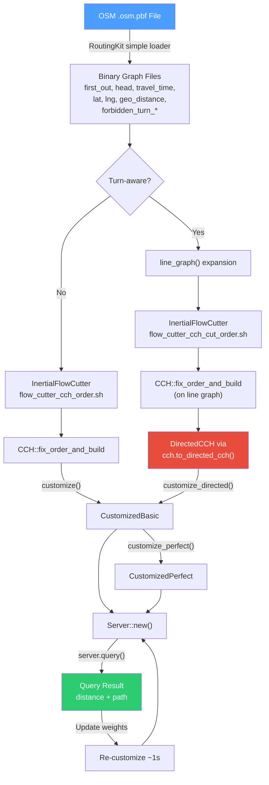

# Original CCH (Static) / rust_road_router: Turn-Aware End-to-End Pipeline

## Overview

The CCH pipeline has three phases:

```
┌─────────────────────────────────────────────┐    ┌────────────────────────────┐    ┌──────────────────────────┐
│  PHASE 1: CONTRACTION                       │    │  PHASE 2: CUSTOMIZATION    │    │  PHASE 3: QUERY          │
│  (Load & Build Graphs)                      │    │  (Load Weights)            │    │                          │
│                                             │    │                            │    │                          │
│  OSM .pbf → Binary Graph → Turn Expansion   │    │  Per metric (~1s):         │    │  Per request (<1ms):     │
│  → Node Ordering → CCH Build → DirectedCCH  │    │  customize() / customize   │    │  Bidirectional elim.     │
│                                             │    │  _directed() → Perfect     │    │  tree walk → path        │
│  ◆ Done once per graph topology (~10 min)   │    │  ◆ Re-run on weight change │    │  unpack → coordinates    │
└─────────────────────────────────────────────┘    └────────────────────────────┘    └──────────────────────────┘
```

> [!IMPORTANT]
> This document covers the **original (static) CCH** pipeline — scalar weights per edge, not time-dependent TTFs.

---

# Phase 1: Contraction (Load & Build Graphs)

Everything in this phase is **metric-independent** — it depends only on graph topology (which nodes connect to which) and coordinates. It runs once per graph and is reused across all weight metrics.

## 1.1 Binary Graph Format

rust_road_router uses **RoutingKit's binary vector format** — raw memory dumps, no headers.

```
File layout: [element_0][element_1]...[element_n-1]
  u32 → 4 bytes per element, little-endian
  f32 → 4 bytes per element, IEEE 754
  File size = element_count × element_size
```

### Required files

| File | Type | Description |
|---|---|---|
| `first_out` | `Vec<u32>` | CSR offset array. `first_out[v]..first_out[v+1]` = edge indices from node `v`. Length = num_nodes + 1. |
| `head` | `Vec<u32>` | Target node of each edge. Length = num_edges. |
| `travel_time` | `Vec<u32>` | Weight per edge (**milliseconds**). Length = num_edges. |
| `latitude` | `Vec<f32>` | Latitude per node (degrees). |
| `longitude` | `Vec<f32>` | Longitude per node (degrees). |

### Complete directory layout

```
your_graph_dir/
├── first_out                 (Vec<u32>)  ← always
├── head                      (Vec<u32>)  ← always
├── travel_time               (Vec<u32>)  ← always (static CCH)
├── latitude                  (Vec<f32>)  ← always
├── longitude                 (Vec<f32>)  ← always
├── geo_distance              (Vec<u32>)  ← optional, from RoutingKit
├── way                       (Vec<u32>)  ← arc → routing way ID (from RoutingKit OSM loader)
├── cch_perm                  (Vec<u32>)  ← generated by InertialFlowCutter (standard)
├── cch_exp_perm              (Vec<u32>)  ← generated by IFC cut order (renamed from cch_perm_cuts)
├── forbidden_turn_from_arc   (Vec<u32>)  ← always (sorted, from RoutingKit OSM loader)
└── forbidden_turn_to_arc     (Vec<u32>)  ← always (sorted, from RoutingKit OSM loader)
```

## 1.2 Extracting a Graph from OSM

RoutingKit provides two API levels for OSM loading:

### Simple API (`osm_simple.h`)

```cpp
#include <routingkit/osm_simple.h>
#include <routingkit/vector_io.h>

auto graph = simple_load_osm_car_routing_graph_from_pbf("hanoi.osm.pbf");
save_vector("dir/first_out",                graph.first_out);
save_vector("dir/head",                     graph.head);
save_vector("dir/travel_time",              graph.travel_time);   // speed_limit × distance → ms
save_vector("dir/geo_distance",             graph.geo_distance);  // edge length in meters
save_vector("dir/latitude",                 graph.latitude);
save_vector("dir/longitude",                graph.longitude);
save_vector("dir/forbidden_turn_from_arc",  graph.forbidden_turn_from_arc);
save_vector("dir/forbidden_turn_to_arc",    graph.forbidden_turn_to_arc);
```

### Builder API (`osm_graph_builder.h` + `osm_profile.h`) — used by CCH-Generator

The two-pass API gives full control: pass 1 discovers OSM IDs, pass 2 builds the graph with profile-specific callbacks for way filtering, speed computation, and turn restriction decoding:

```cpp
#include <routingkit/osm_graph_builder.h>
#include <routingkit/osm_profile.h>

// Pass 1: discover which OSM ways/nodes are relevant
auto mapping = load_osm_id_mapping_from_pbf(pbf_path, nullptr, way_filter_fn, log_fn, false);

// Pass 2: build graph with speed + direction + turn restriction callbacks
auto graph = load_osm_routing_graph_from_pbf(
    pbf_path, mapping,
    way_callback,           // returns direction category + captures way speed
    turn_restriction_fn,    // profile-aware turn restriction decoder
    log_fn, false,
    OSMRoadGeometry::none
);
// graph.first_out, graph.head, graph.way, graph.geo_distance, graph.latitude, etc.
// travel_time computed manually: geo_distance * 18000 / (way_speed * 5)
```

This is what [CCH-Generator/src/generate_graph.cpp](CCH-Generator/src/generate_graph.cpp) uses. It supports car and motorcycle profiles via `osm_profile.h` callbacks (`is_osm_way_used_by_cars`, `get_osm_way_speed`, `decode_osm_car_turn_restrictions`, etc.).

> [!NOTE]
> `travel_time` from the simple API = `geo_distance / speed_limit_kmh * 3.6 * 1000` (milliseconds).
> CCH-Generator computes it equivalently as `geo_distance * 18000 / (way_speed * 5)`.
> If you have better speed data (GPS probes, sensors), overwrite `travel_time` while keeping the topology files untouched.
>
> RoutingKit **does** extract via-node turn restrictions (`no_left_turn`, `no_u_turn`, etc.) — they are included in the `forbidden_turn_*` output. It only drops via-way restrictions (handled by the Phase 1 `conditional_turn_extract` tool — see `docs/Conditional Turns Implementation.md`).

**Alternative: Python** (any data source):
```python
import numpy as np
np.array(first_out, dtype=np.uint32).tofile("dir/first_out")
np.array(head, dtype=np.uint32).tofile("dir/head")
np.array(travel_time, dtype=np.uint32).tofile("dir/travel_time")
np.array(latitude, dtype=np.float32).tofile("dir/latitude")
np.array(longitude, dtype=np.float32).tofile("dir/longitude")
```

### Overwriting weights with custom data

Use RoutingKit for **topology** (`first_out`, `head`, `lat`, `lng`), then overwrite `travel_time` with your own sensor data:

```python
import numpy as np
travel_time = np.fromfile("dir/travel_time", dtype=np.uint32).copy()  # OSM baseline
geo_distance = np.fromfile("dir/geo_distance", dtype=np.uint32)

for edge_id, velocity_kmh in my_sensor_data:
    travel_time[edge_id] = int(geo_distance[edge_id] / (velocity_kmh / 3.6) * 1000)

travel_time.tofile("dir/travel_time")  # edges without data keep OSM weights
```

## 1.3 Turn Expansion (Line Graph)

For turn-aware routing, the original graph is **expanded** into a **line graph** where:
- Each original **edge** becomes a **node**
- Each allowed **turn** (edge₁ → edge₂) becomes an **edge** with weight = `edge₁.weight + turn_cost`
- Forbidden turns and U-turns produce **no edge** (effectively infinite cost)

> [!WARNING]
> The line graph must be built **before** the CCH — the CCH is constructed on the line graph, not the original graph. Node ordering, CCH build, and DirectedCCH conversion all operate on the expanded graph.

### The `line_graph` function

Source: [graph.rs:181-201](rust_road_router/engine/src/datastr/graph.rs#L181-L201)

```rust
pub fn line_graph(
    graph: &impl EdgeRandomAccessGraph<Link>,
    mut turn_costs: impl FnMut(EdgeId, EdgeId) -> Option<Weight>,
) -> OwnedGraph {
    // For each original edge (= new node):
    //   For each outgoing edge of head(edge) (= potential turn):
    //     If turn_costs returns Some(cost): create edge with weight = edge.weight + cost
    //     If turn_costs returns None: skip (forbidden turn)
}
```

### Turn cost callback with forbidden turns

Source: [cchpot_live_turns.rs:46-62](rust_road_router/chpot/src/bin/cchpot_live_turns.rs#L46-L62) and [cch_with_turns.rs](rust_road_router/engine/src/bin/cch_with_turns.rs)

```rust
// Load forbidden turns (extracted by RoutingKit's OSM loader)
let forbidden_from = Vec::<EdgeId>::load_from(path.join("forbidden_turn_from_arc"))?;
let forbidden_to = Vec::<EdgeId>::load_from(path.join("forbidden_turn_to_arc"))?;

// Build tail array (needed for U-turn detection)
let mut tail = Vec::with_capacity(graph.num_arcs());
for node in 0..graph.num_nodes() {
    for _ in 0..graph.degree(node as NodeId) {
        tail.push(node as NodeId);
    }
}

// Sorted iterator for O(n) forbidden-turn lookup
let mut iter = forbidden_from.iter().zip(forbidden_to.iter()).peekable();

let exp_graph = line_graph(&graph, |edge1_idx, edge2_idx| {
    // Advance sorted iterator past edges we've passed
    while let Some((&from_arc, &to_arc)) = iter.peek() {
        if from_arc < edge1_idx || (from_arc == edge1_idx && to_arc < edge2_idx) {
            iter.next();
        } else {
            break;
        }
    }

    // Check forbidden turn
    if iter.peek() == Some(&(&edge1_idx, &edge2_idx)) {
        return None;  // forbidden turn
    }
    // Check U-turn: tail of edge1 == head of edge2
    if tail[edge1_idx as usize] == graph.head()[edge2_idx as usize] {
        return None;  // U-turn
    }
    Some(0)  // allowed turn, 0ms penalty
});
```

> [!WARNING]
> **Line graph identity mapping**: In the line graph, node ID `k` directly corresponds to edge ID `k` in the original graph (1:1 mapping). When extracting paths, the "node path" from the line graph gives you original **edge** IDs. You must map these back to original nodes yourself (see Phase 3).

### Standalone line graph export tool (Rust)

Source: [turn_expand_osm.rs](rust_road_router/cchpp/src/bin/turn_expand_osm.rs)

This binary reads an original graph directory, builds the line graph, and writes the expanded graph to a separate output directory:

```bash
cargo run --release -p cchpp --bin turn_expand_osm -- <input_graph_dir> <output_line_graph_dir>
```

It produces 5 files: `first_out`, `head`, `travel_time` (line graph CSR), plus `latitude` and `longitude` mapped per line graph node (using the tail node's coordinates: `lat[tail[edge_id]]`). The output directory can then be fed directly to InertialFlowCutter for node ordering.

## 1.4 Node Ordering

The CCH requires a **nested dissection order** — a permutation of node IDs that groups nodes into recursively separated cells. This is generated by [InertialFlowCutter](https://github.com/kit-algo/InertialFlowCutter).

> [!NOTE]
> The ordering is **metric-independent** — it only uses graph topology and coordinates. Once generated, it works for any weight metric.

### Standard ordering (no turns)

```bash
# Using the provided script (from rust_road_router/):
./flow_cutter_cch_order.sh /path/to/graph_dir

# Or manually:
./lib/InertialFlowCutter/build/console \
   load_routingkit_unweighted_graph "$DIR/first_out" "$DIR/head" \
   load_routingkit_longitude "$DIR/longitude" \
   load_routingkit_latitude "$DIR/latitude" \
   remove_multi_arcs \
   remove_loops \
   add_back_arcs \
   sort_arcs \
   flow_cutter_set geo_pos_ordering_cutter_count 8 \
   reorder_nodes_in_accelerated_flow_cutter_cch_order \
   save_routingkit_node_permutation_since_last_load "$DIR/cch_perm"
```

**Output**: `cch_perm` — a `Vec<u32>` permutation mapping rank → original node ID.

### Line graph ordering (turn-aware)

For turn-expanded graphs, you need a **separate** ordering where nodes = original edges. The cut-based ordering operates on the original graph's arcs, producing an arc permutation that becomes the node permutation for the line graph:

```bash
# From rust_road_router/:
./flow_cutter_cch_cut_order.sh /path/to/graph_dir
# Produces: cch_perm_cuts (arc permutation on original graph)

# Rename for the turn-aware pipeline:
mv graph_dir/cch_perm_cuts graph_dir/cch_exp_perm
```

> [!NOTE]
> `flow_cutter_cch_cut_order.sh` uses `reorder_arcs_in_accelerated_flow_cutter_cch_order` and `save_routingkit_arc_permutation_since_last_load` — it produces an **arc** permutation (not a node permutation). Since line graph nodes = original arcs, this arc permutation IS the line graph's node ordering.

## 1.5 Build CCH Structure

The CCH construction phase computes the **chordal supergraph** — the set of all possible shortcuts for any metric. This is **metric-independent** and only needs to run once.

### The FAST algorithm (chordal completion)

Source: [contraction.rs](rust_road_router/engine/src/algo/customizable_contraction_hierarchy/contraction.rs)

1. **Translate to rank space**: Node IDs are replaced by their ranks from the ordering. Edges are filtered to upward-only (toward higher rank).
2. **Make undirected**: Ensure every edge `u→v` also has `v→u`, because CCH needs to reason about paths in both directions.
3. **Chordal completion**: Process nodes in increasing rank order. For each node being "contracted":
   - Find its **lowest-ranked neighbor** (since neighbors are sorted ascending, this is `edges[0]`).
   - **Merge** the remaining neighbors into the lowest neighbor's adjacency list.
   - This guarantees the supergraph is chordal (every cycle of length ≥ 4 has a chord).

```rust
// The core contraction loop (simplified from contraction.rs):
while let Some((node, mut subgraph)) = graph.remove_lowest() {
    if let Some((&lowest_neighbor, other_neighbors)) = node.edges.split_first() {
        subgraph[lowest_neighbor].merge_neighbors(other_neighbors);
        // ↑ This single operation IS the chordal completion
    }
}
```

### Order reordering for parallelization

Source: [reorder.rs](rust_road_router/engine/src/algo/customizable_contraction_hierarchy/reorder.rs)

The `fix_order_and_build` method does this automatically:

1. Build CCH once (to get the elimination tree and separator tree)
2. **Reorder** the node order so that separator cells form consecutive ID ranges (required for parallel customization)
3. Build CCH **again** with the reordered permutation

```rust
// This is what fix_order_and_build does internally (mod.rs:64-71):
pub fn fix_order_and_build(graph, order) -> CCH {
    let contracted = ContractionGraph::new(graph, order.clone()).contract();
    let order = reorder_for_seperator_based_customization(
        &order,
        SeparatorTree::new(&contracted.elimination_tree())
    );
    contract(graph, order)  // build again with fixed order
}
```

### What gets built

Source: [mod.rs:31-41](rust_road_router/engine/src/algo/customizable_contraction_hierarchy/mod.rs#L31-L41)

The `CCH` struct contains:

| Field | Purpose |
|---|---|
| `first_out`, `head`, `tail` | The chordal supergraph in CSR format (upward edges only). |
| `node_order` | The reordered nested dissection permutation. |
| `forward_cch_edge_to_orig_arc` | Maps each CCH edge → list of original forward arcs it could represent. |
| `backward_cch_edge_to_orig_arc` | Maps each CCH edge → list of original backward arcs it could represent. |
| `elimination_tree` | Parent pointer for each node. Parent = lowest-ranked upward neighbor. |
| `inverted` | Reversed graph with edge IDs (for customization lower-triangle enumeration). |
| `separator_tree` | The reconstructed nested dissection tree (for parallelization). |

### Code: basic CCH build

```rust
// Standard graph:
let graph = WeightedGraphReconstructor("travel_time").reconstruct_from(&path)?;
let order = NodeOrder::from_node_order(Vec::load_from(path.join("cch_perm"))?);
let cch = CCH::fix_order_and_build(&graph, order);  // ~5 min for large graphs

// Turn-expanded graph:
let graph = WeightedGraphReconstructor("travel_time").reconstruct_from(&path)?;
let exp_graph = line_graph(&graph, |e1, e2| /* turn cost callback */);
let order = NodeOrder::from_node_order(Vec::load_from(path.join("cch_exp_perm"))?);
let cch = CCH::fix_order_and_build(&exp_graph, order);
```

## 1.6 DirectedCCH (Turn-Expanded Graphs Only)

For **turn-expanded (line) graphs**, many shortcuts are valid in only one direction (turns are inherently directional). The `DirectedCCH` exploits this by pruning always-infinity edges, reducing the graph by 30–50%.

Source: [mod.rs:159-219](rust_road_router/engine/src/algo/customizable_contraction_hierarchy/mod.rs#L159-L219)

**How it works:**
1. Run `always_infinity(cch)` — customizes with a zero metric to identify edges that are ∞ in one or both directions
2. **Prune** edges that are always ∞ in their respective direction
3. Store **separate** forward and backward graphs with separate inverted indices

```rust
// After building the CCH on the line graph:
let cch = CCH::fix_order_and_build(&exp_graph, order);
let directed_cch = cch.to_directed_cch();  // ← prunes dead edges
```

### DirectedCCH fields

Source: [mod.rs:606-620](rust_road_router/engine/src/algo/customizable_contraction_hierarchy/mod.rs#L606-L620)

| Field | Purpose |
|---|---|
| `forward_first_out`, `forward_head`, `forward_tail` | Forward (upward) graph — only edges that carry finite weight going forward. |
| `backward_first_out`, `backward_head`, `backward_tail` | Backward (downward) graph — only edges that carry finite weight going backward. |
| `forward_inverted`, `backward_inverted` | **Separate** inverted indices for forward and backward graphs. |
| *Everything else* | Same as CCH (node_order, elimination_tree, separator_tree, edge-to-orig mappings). |

### Alternative: `remove_always_infinity()` (pruned symmetric CCH)

If you want a pruned CCH but **don't** need separate forward/backward graphs:

```rust
let pruned_cch = cch.remove_always_infinity();  // still symmetric, but dead edges removed
let customized = customize(&pruned_cch, &graph);
```

This is less aggressive than `to_directed_cch()` — it keeps an edge if it carries finite weight in **either** direction.

## 1.7 Persistence (Save/Load CCH to Disk)

Both `CCH` and `CustomizedPerfect` implement `Deconstruct`/`ReconstructPrepared` for disk persistence:

```rust
// Save CCH structure:
cch.deconstruct_to(&path)?;  // writes cch_first_out, cch_head

// Reload later (needs original graph for edge mapping reconstruction):
let cch = CCHReconstrctor(&graph).reconstruct_from(&path)?;

// Save CustomizedPerfect:
customized_perfect.deconstruct_to(&path)?;  // writes fw_graph/, bw_graph/, up_unpacking, down_unpacking

// Reload later:
let perfect: CustomizedPerfect = (&cch).reconstruct_from(&path)?;
```

> [!TIP]
> For production: save the CCH after building it once. On server restart, reload the CCH (~seconds) instead of rebuilding (~minutes).

---

# Phase 2: Customization (Load Weights)

Customization fills the chordal supergraph's shortcut edges with actual weights from a specific metric. The CCH structure from Phase 1 is **shared** across metrics — only weights change. Customization takes ~1 second and is re-run whenever weights change.

## 2.1 Basic Customization

Source: [customization.rs:21-35](rust_road_router/engine/src/algo/customizable_contraction_hierarchy/customization.rs#L21-L35)

Two sub-phases:

### Sub-phase 1: Respecting (copy original weights)

```
For each CCH (upward) edge:
    upward_weight[e]   = min of all original forward arcs it maps to
    downward_weight[e] = min of all original backward arcs it maps to
```

This is the `prepare_weights` function ([customization.rs:69-94](rust_road_router/engine/src/algo/customizable_contraction_hierarchy/customization.rs#L69-L94)). It runs in parallel with rayon.

### Sub-phase 2: Lower triangle relaxation

Nodes are processed in **increasing rank order**. For each node `v`:
1. Store outgoing/incoming weights in a workspace indexed by neighbor node ID
2. For each **lower neighbor** `u` of `v` (via the inverted graph):
   - For each **upward neighbor** `w` of `u` where `w > v`:
     - Relax: `upward[v→w] = min(upward[v→w], upward[u→w] + downward[v→u])`
     - Relax: `downward[v→w] = min(downward[v→w], downward[u→w] + upward[v→u])`
3. Copy relaxed weights back to edges

This is parallelized using the **separator decomposition**: cells within the same level can be customized independently, synchronized only at separator nodes.

```rust
let customized = customize(&cch, &graph);
// customized: CustomizedBasic<CCH> — contains upward[] and downward[] weight vectors
```

## 2.2 Perfect Customization (Recommended)

Source: [customization.rs:252](rust_road_router/engine/src/algo/customizable_contraction_hierarchy/customization.rs#L252)

Basic customization uses only **lower triangles**. Perfect customization additionally processes **intermediate and upper triangles**, processing nodes in **decreasing rank** order:

- For node `v` and its neighbors `u` and `w` via a common higher-ranked node:
  - Relax `upward[v→w]` via `upward[v→u] + upward[u→w]`
  - Relax `downward[v→w]` via `downward[v→u] + downward[u→w]`
  - (and the cross combinations)

After perfect customization, redundant edges (those that were relaxed and are no longer on any shortest path) are **removed**, producing a sparser `CustomizedPerfect` with separate forward/backward `OwnedGraph`s.

```rust
let customized = customize(&cch, &graph);
let perfect = customize_perfect(customized);
// perfect: CustomizedPerfect<CCH> — separate fw/bw graphs, fewer edges
let mut server = Server::new(perfect);
```

> [!TIP]
> Perfect customization makes queries faster by reducing the number of edges to scan, at the cost of slightly more preprocessing time. For production systems, **always use it**.

## 2.3 Directed Customization (for DirectedCCH)

Source: [customization/directed.rs](rust_road_router/engine/src/algo/customizable_contraction_hierarchy/customization/directed.rs)

`customize_directed` works like basic customization but with separate forward/backward edge sets and separate offsets:
- Forward lower-triangle relaxation uses `backward_inverted` + forward upward edges
- Backward lower-triangle relaxation uses `forward_inverted` + backward upward edges

```rust
let customized = customize_directed(&directed_cch, &exp_graph);
// Or with perfect customization:
let perfect = customize_directed_perfect(customize_directed(&directed_cch, &exp_graph));
let mut server = Server::new(customized);  // or Server::new(perfect)
```

## 2.4 Decision Tree: Which Customization to Use?

```
Is your graph turn-expanded (line graph)?
├── Yes → Use DirectedCCH (built in Phase 1)
│   ├── customize_directed(&directed_cch, &graph)
│   └── Optional: customize_directed_perfect(...)
└── No → Use standard CCH
    ├── customize(&cch, &graph)
    └── Optional: customize_perfect(customize(&cch, &graph))
```

## 2.5 Multi-Metric Customization

The CCH structure is metric-independent. Customize once per metric, share the structure:

```rust
let cch = CCH::fix_order_and_build(&graph, order);                              // once, ~5 min

let time_server = Server::new(customize_perfect(customize(&cch, &time_graph))); // ~1s
let dist_server = Server::new(customize_perfect(customize(&cch, &dist_graph))); // ~1s
// Both share the same cch — only weights differ
```

## 2.6 Live Traffic Updates

The CCH structure **never changes** when weights update — only re-customization is needed (~1 second).

```rust
// Update travel_time from live data
for (edge_id, velocity_kmh) in live_sensor_data {
    travel_time[edge_id] = (geo_distance[edge_id] as f64 / (velocity_kmh / 3.6) * 1000.0) as u32;
}

// Re-customize (~1s, no CCH rebuild needed)
let new_graph = FirstOutGraph::new(&first_out, &head, &travel_time);
let new_customized = customize_perfect(customize(&cch, &new_graph));
server.update(new_customized);
// All subsequent queries use the new weights
```

### Refresh loop

```
Every 1–5 minutes:
  1. Receive velocity data (GPS probes, sensors)
  2. Fuse into travel_time_ms per edge
  3. Re-customize (~1s)
  4. server.update(new_customized)
  5. All subsequent queries use updated weights
```

---

# Phase 3: Query

## 3.1 How It Works: Bidirectional Elimination Tree Walk

Source: [query.rs](rust_road_router/engine/src/algo/customizable_contraction_hierarchy/query.rs) and [stepped_elimination_tree.rs](rust_road_router/engine/src/algo/customizable_contraction_hierarchy/query/stepped_elimination_tree.rs)

The query runs **two** simultaneous walks up the elimination tree — one from `source`, one from `target`:

1. **Map to rank space**: `from_rank = order.rank(from)`, `to_rank = order.rank(to)`
2. **Initialize**: Set `fw_distances[from_rank] = 0`, `bw_distances[to_rank] = 0`
3. **Interleaved walk**: Both walks follow parent pointers up the elimination tree. At each step:
   - The walk with the **lower-ranked** current node goes first
   - When both walks are at the **same node**: check if `fw_dist + bw_dist` improves the tentative best distance
   - Each walk **relaxes edges** to upward neighbors (forward walk uses upward weights, backward walk uses downward weights)
   - **Pruning**: If a node's tentative distance ≥ current best, skip edge relaxation (`skip_next`)
4. **Distances are reset** as we go (for O(1) reuse across queries — no full array reset needed)

```
Forward walk:  source → ... → meeting_node → ... → root
Backward walk: target → ... → meeting_node → ... → root
                                    ↑
                               Best distance found here
```

## 3.2 Running a Query

```rust
let result = server.query(Query { from: 42, to: 1337 });
if let Some(mut found) = result.found() {
    let distance = found.distance();   // milliseconds
    let path = found.node_path();      // Vec<NodeId> — original node IDs
}
```

## 3.3 Path Unpacking

Source: [query.rs:131-176](rust_road_router/engine/src/algo/customizable_contraction_hierarchy/query.rs#L131-L176)

The elimination tree walk finds a path through the **contracted** graph (using shortcuts). The actual path must be **unpacked**:

1. From the meeting node, trace parent pointers to reconstruct the contracted path
2. For each shortcut edge: look up `(down_edge, up_edge, middle_node)` in `up_unpacking` / `down_unpacking`
3. Recursively replace the shortcut with its two sub-edges until only original edges remain
4. Finally, map all rank-space node IDs back to original IDs via `order.node(rank)`

```rust
// Simplified from query.rs:159-176:
fn unpack_path(origin, target, customized, parents) {
    let mut current = target;
    while current != origin {
        let (pred, edge) = parents[current];
        let unpacked = if pred > current {
            customized.unpack_outgoing(edge)   // shortcut going up
        } else {
            customized.unpack_incoming(edge)   // shortcut going down
        };
        if let Some((down, up, middle)) = unpacked {
            parents[current] = (middle, down);
            parents[middle] = (pred, up);
        } else {
            current = pred;  // original edge, no unpacking needed
        }
    }
}
```

## 3.4 Extracting Results

### Standard graph (no turns)

```rust
// Geo coordinates from node path
let geo_path: Vec<(f32, f32)> = path.iter()
    .map(|&n| (lat[n as usize], lng[n as usize])).collect();
```

### Turn-expanded (line graph)

In the line graph, the "node path" returned by the query contains **original edge IDs** (since line graph node = original edge). To get the original node sequence:

```rust
// line_graph_path: Vec<NodeId> where each "node" is an original edge_id
let original_node_path: Vec<NodeId> = std::iter::once(tail[line_graph_path[0] as usize])
    .chain(line_graph_path.iter().map(|&edge_id| head[edge_id as usize]))
    .collect();

// Then map to coordinates
let geo_path: Vec<(f32, f32)> = original_node_path.iter()
    .map(|&n| (lat[n as usize], lng[n as usize])).collect();
```

## 3.5 CCH-Potentials for A* on Turn-Expanded Graphs

For queries on line graphs, the codebase also supports using the CCH as a **potential function** (lower bound) for A* search via `TurnExpandedPotential`. This builds a CCH on the **original** (non-expanded) graph and uses it to provide lower bounds for a bidirectional Dijkstra/A* on the expanded graph:

```rust
// Build CCH potential on the ORIGINAL (non-expanded) graph
let cch_pot_data = CCHPotData::new(&cch, &original_graph);

// Wrap as turn-expanded potential
let pots = (
    TurnExpandedPotential::new(&original_graph, cch_pot_data.forward_potential()),
    TurnExpandedPotential::new(&original_graph, cch_pot_data.backward_potential()),
);

// Use as bidirectional A* on the expanded graph
let mut server = BiDirServer::new(&exp_graph, SymmetricBiDirPotential::new(pots.0, pots.1));
```

> [!NOTE]
> This is an alternative query strategy. The standard elimination tree walk (Section 3.1) is typically faster — use `TurnExpandedPotential` only when you need a bidirectional Dijkstra/A* on the unexpanded CCH for other reasons (e.g., experiments).

---

# Complete Turn-Aware Pipeline Example

Combining all three phases into one working example based on [cch_with_turns.rs](rust_road_router/engine/src/bin/cch_with_turns.rs):

```rust
use rust_road_router::{
    algo::customizable_contraction_hierarchy::{query::Server, *},
    datastr::{graph::*, node_order::NodeOrder},
    io::*,
};

fn main() -> Result<(), Box<dyn std::error::Error>> {
    let path = Path::new("your_graph_dir");

    // ═══════════════════════════════════════════════
    // PHASE 1: CONTRACTION (Load & Build)
    // ═══════════════════════════════════════════════

    // 1a. Load original graph
    let graph = WeightedGraphReconstructor("travel_time").reconstruct_from(&path)?;

    // 1b. Load forbidden turns
    let forbidden_from = Vec::<EdgeId>::load_from(path.join("forbidden_turn_from_arc"))?;
    let forbidden_to = Vec::<EdgeId>::load_from(path.join("forbidden_turn_to_arc"))?;

    // 1c. Build tail array for U-turn detection
    let mut tail = Vec::with_capacity(graph.num_arcs());
    for node in 0..graph.num_nodes() {
        for _ in 0..graph.degree(node as NodeId) { tail.push(node as NodeId); }
    }

    // 1d. Build turn-expanded line graph
    let mut iter = forbidden_from.iter().zip(forbidden_to.iter()).peekable();
    let exp_graph = line_graph(&graph, |e1, e2| {
        while let Some((&f, &t)) = iter.peek() {
            if f < e1 || (f == e1 && t < e2) { iter.next(); } else { break; }
        }
        if iter.peek() == Some(&(&e1, &e2)) { return None; }       // forbidden
        if tail[e1 as usize] == graph.head()[e2 as usize] { return None; } // U-turn
        Some(0)
    });

    // 1e. Build CCH on line graph → convert to DirectedCCH
    let order = NodeOrder::from_node_order(Vec::load_from(path.join("cch_exp_perm"))?);
    let cch = CCH::fix_order_and_build(&exp_graph, order);
    let directed_cch = cch.to_directed_cch();  // prunes dead edges

    // ═══════════════════════════════════════════════
    // PHASE 2: CUSTOMIZATION (Load Weights, ~1s)
    // ═══════════════════════════════════════════════

    let customized = customize_directed(&directed_cch, &exp_graph);

    // ═══════════════════════════════════════════════
    // PHASE 3: QUERY
    // ═══════════════════════════════════════════════

    let mut server = Server::new(customized);
    let result = server.query(Query { from: source_edge_id, to: target_edge_id });
    if let Some(mut found) = result.found() {
        let distance_ms = found.distance();
        let edge_path = found.node_path();  // "nodes" = original edge IDs
    }

    Ok(())
}
```

---

# Architecture Reference


