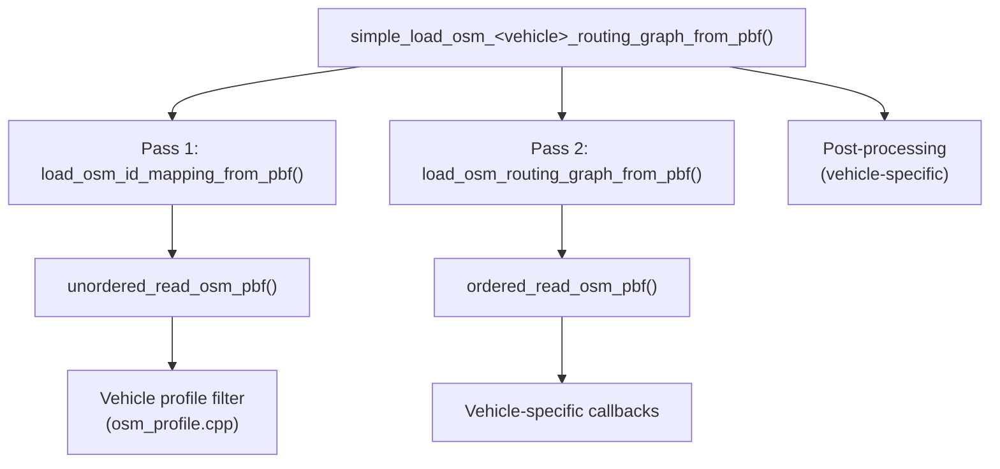

# RoutingKit OSM `.osm.pbf` Loading Flow

## Overview

RoutingKit loads `.osm.pbf` files using a **two-pass architecture**. The simple API in [osm_simple.h](file:///home/thomas/VTS/Hanoi%20Routing/RoutingKit/include/routingkit/osm_simple.h) provides per-vehicle entry points that internally call two lower-level functions in sequence.

## Architecture Diagram



---

## Pass 1 — ID Discovery

**Function**: [load_osm_id_mapping_from_pbf()](file:///home/thomas/VTS/Hanoi%20Routing/RoutingKit/src/osm_graph_builder.cpp#L21-L114) in [osm_graph_builder.cpp](file:///home/thomas/VTS/Hanoi%20Routing/RoutingKit/src/osm_graph_builder.cpp)

**Signature**:

```cpp
OSMRoutingIDMapping load_osm_id_mapping_from_pbf(
    const std::string& file_name,
    std::function<bool(uint64_t osm_node_id, const TagMap& node_tags)> is_routing_node,
    std::function<bool(uint64_t osm_way_id, const TagMap& way_tags)> is_way_used_for_routing,
    std::function<void(const std::string&)> log_message = nullptr,
    bool all_modelling_nodes_are_routing_nodes = false
);
```

**Steps**:

1. Performs a fast **unordered scan** of the PBF via [unordered_read_osm_pbf()](file:///home/thomas/VTS/Hanoi%20Routing/RoutingKit/include/routingkit/osm_decoder.h#25-32). No relation callback is registered.
2. **Node callback** (only if `is_routing_node` is non-null): for each node where `is_routing_node(osm_node_id, tags)` returns true, marks it in both `is_modelling_node` and `is_routing_node`. All three simple wrappers pass `nullptr` here.
3. **Way callback**: for each way with **`node_list.size() >= 2`** and `is_way_used_for_routing(osm_way_id, tags)` returning true:
   - Marks the way in `is_routing_way`.
   - For each node in the way:
     - If `all_modelling_nodes_are_routing_nodes` is true: marks the node as both modelling and routing.
     - Otherwise: if the node is already a modelling node (seen in a previous way), promotes it to routing node (intersection). Otherwise marks it as modelling only.
   - **First and last nodes** of the way are always promoted to routing nodes (endpoints).
4. Asserts that first/last nodes of each routing way are modelling nodes.

**Output**: [OSMRoutingIDMapping](file:///home/thomas/VTS/Hanoi%20Routing/RoutingKit/include/routingkit/osm_graph_builder.h#15-20) containing three `BitVector`s:
- `is_modelling_node` — all nodes that appear in any routing way
- `is_routing_node` — subset: intersection nodes + endpoint nodes (+ any tagged nodes if `is_routing_node` callback is used)
- `is_routing_way` — all ways that passed the vehicle filter

---

## Pass 2 — Graph Construction

**Function**: [load_osm_routing_graph_from_pbf()](file:///home/thomas/VTS/Hanoi%20Routing/RoutingKit/src/osm_graph_builder.cpp#L116-L835) in [osm_graph_builder.cpp](file:///home/thomas/VTS/Hanoi%20Routing/RoutingKit/src/osm_graph_builder.cpp)

**Signature**:

```cpp
OSMRoutingGraph load_osm_routing_graph_from_pbf(
    const std::string& pbf_file,
    const OSMRoutingIDMapping& mapping,
    std::function<OSMWayDirectionCategory(uint64_t osm_way_id, unsigned routing_way_id, const TagMap& way_tags)> way_callback,
    std::function<void(uint64_t osm_relation_id, const std::vector<OSMRelationMember>& member_list,
                       const TagMap& tags, std::function<void(OSMTurnRestriction)>)> turn_restriction_decoder,
    std::function<void(const std::string&)> log_message = nullptr,
    bool file_is_ordered_even_though_file_header_says_that_it_is_unordered = false,
    OSMRoadGeometry geometry_to_be_extracted = OSMRoadGeometry::none
);
```

**Steps**:

1. Builds `IDMapper` objects to translate OSM global IDs → compact local IDs for modelling nodes, routing nodes, and routing ways.
2. **Geometry auto-upgrade**: if `turn_restriction_decoder` is non-null and `geometry_to_be_extracted == OSMRoadGeometry::none`, the geometry mode is silently upgraded to `first_and_last`. This is required because angle-based turn disambiguation needs the first/last modelling node positions of each arc.
3. Performs a **sorted/ordered scan** via [ordered_read_osm_pbf()](file:///home/thomas/VTS/Hanoi%20Routing/RoutingKit/include/routingkit/osm_decoder.h#33-41) (nodes → ways → relations).
4. **Node callback**: stores lat/lon for each modelling node.
5. **Way callback**: for each routing way, calls the user-provided `way_callback(osm_way_id, routing_way_id, tags)`:
   - The callback receives the **routing way ID** (compact local ID, 0-based) which callers use to index per-way arrays (e.g. `way_speed[routing_way_id]`).
   - Returns `OSMWayDirectionCategory`; `closed` causes the way to be skipped entirely.
6. **Arc creation**: walks the way's node list, creating arcs between consecutive routing nodes:
   - `geo_dist()` computes great-circle distance between intermediate modelling nodes.
   - Direction handling from the returned `OSMWayDirectionCategory`:
     - `only_open_forwards`: one arc in way-node-list direction
     - `open_in_both`: two arcs (forward and backward)
     - `only_open_backwards`: one arc in reverse direction
   - Each arc stores: `tail`, `head`, `geo_distance`, `way` (routing way ID), `is_arc_antiparallel_to_way` (true if arc runs opposite to way node order).
   - If `geometry_to_be_extracted != none`: stores per-arc modelling node lat/lon via `first_modelling_node` offsets.
7. **Relation callback**: if `turn_restriction_decoder` is non-null, each relation is passed to it. The decoder calls `on_new_restriction(OSMTurnRestriction)` for each restriction found; these are collected into `osm_turn_restrictions`.
8. **Post-processing**: sorts arcs by tail→head, builds `first_out` adjacency array, then processes turn restrictions (see below).

### OSMRoadGeometry Enum

```cpp
enum class OSMRoadGeometry {
    none,            // no intermediate geometry stored
    uncompressed,    // all modelling node positions stored per-arc
    first_and_last   // only first and last modelling node per-arc (needed for angle disambiguation)
};
```

When `first_and_last` or `uncompressed` is used, the graph includes `first_modelling_node`, `modelling_node_latitude`, and `modelling_node_longitude` arrays that store intermediate road geometry. These are essential for angle-based disambiguation of ambiguous turn restrictions.

### `is_arc_antiparallel_to_way`

This boolean vector (one entry per arc) indicates whether the arc runs in the **opposite** direction of the OSM way's node ordering. This is set to `true` for arcs created from `open_in_both` ways (the reverse-direction copy) or `only_open_backwards` ways. Consumers can use this to determine the original OSM way direction for a given arc.

---

## Vehicle Profiles — Tag Filtering & Attribute Extraction

### Car Profile ([osm_profile.cpp](file:///home/thomas/VTS/Hanoi%20Routing/RoutingKit/src/osm_profile.cpp))

#### [is_osm_way_used_by_cars()](file:///home/thomas/VTS/Hanoi%20Routing/RoutingKit/include/routingkit/osm_profile.h#13-14)

Tag check order (short-circuits at first match):

1. `junction` is set (any value) → **true**
2. `route=ferry` → **true**
3. `ferry=yes` → **true**
4. `highway` not set → **false**
5. `motorcar=no` → **false**
6. `motor_vehicle=no` → **false**
7. `access` set but not in `{yes, permissive, delivery, designated, destination}` → **false**
8. `highway` in `{motorway, trunk, primary, secondary, tertiary, unclassified, residential, service, motorway_link, trunk_link, primary_link, secondary_link, tertiary_link, motorway_junction, living_street, track, ferry}` → **true**
9. `highway=bicycle_road` with `motorcar=yes` → **true**; otherwise **false**
10. `highway` in `{construction, path, footway, cycleway, bridleway, pedestrian, bus_guideway, raceway, escape, steps, proposed, conveying}` → **false**
11. `oneway=reversible` or `oneway=alternating` → **false**
12. `maxspeed` set (any value) → **true**
13. Default → **false**

#### [get_osm_car_direction_category()](file:///home/thomas/VTS/Hanoi%20Routing/RoutingKit/include/routingkit/osm_profile.h#16-17)

| Condition | Result |
|---|---|
| `oneway` in `-1, reverse, backward` | `only_open_backwards` |
| `oneway` in `yes, true, 1` | `only_open_forwards` |
| `oneway` in `no, false, 0` | `open_in_both` |
| `oneway` in `reversible, alternating` | `closed` |
| Unknown `oneway` value | **`open_in_both`** (with log warning — see bug note below) |
| `junction=roundabout` (no `oneway` tag) | `only_open_forwards` |
| `highway` in `motorway, motorway_link` (no `oneway` tag) | `only_open_forwards` |
| Default | `open_in_both` |

> [!WARNING]
> **RoutingKit bug (osm_profile.cpp:281–290)**: When `oneway` has an unrecognised value (not any of the known strings above), the `else` branch at line 281 logs the message `"Way is closed."` but contains **no `return` statement**. Execution falls through to line 290 and returns `open_in_both`. The log message directly contradicts the actual behaviour — the way is treated as **bidirectional**, not closed. This means ways with non-standard `oneway` values (e.g. `oneway=yes;no`, typos, or regional variants) are silently opened in both directions rather than being excluded.

#### [get_osm_way_speed()](file:///home/thomas/VTS/Hanoi%20Routing/RoutingKit/src/osm_profile.cpp#364-452) — Speed Determination

**Priority 1 — `maxspeed` tag** (if set and not `unposted`):
- Value is lowercased. Semicolons split multiple values; the **minimum** is taken.
- `parse_maxspeed_value` handles these special values:
  - `signals`, `variable` → `inf_weight` (treated as no info)
  - `none`, `unlimited` → 130 km/h
  - `walk`, `foot`, `??:walk`, `walking_pace`, `schritt` → 5 km/h
  - `??:urban`, `urban` → 40 km/h
  - `??:living_street`, `living_street` → 10 km/h
  - Country-specific: `de:rural`/`at:rural`/`ro:rural`/`rural` → 100; `ru:rural`/`ua:rural` → 90; `dk:rural`/`ch:rural`/`fr:rural` → 80; `it:rural`/`hu:rural` → 90
  - Country-specific motorway: `ru:motorway` → 110; `ch:motorway` → 120; `at:motorway`/`ro:motorway`/`de:motorway` → 130
  - `national` → 100; `ro:trunk` → 100
  - `de:zone:30`, `de:zone30`, `at:zone30` → 30
  - Numeric values: parsed with optional `km/h`/`kmh`/`kph` (default), `mph` (×1.609), `knots` (×1.852)
  - Unrecognized → `inf_weight` (with log warning)
- Speed 0 is clamped to 1 km/h (with log warning).
- If all parsed values are `inf_weight`, falls through to priority 2.

**Priority 2 — `highway` tag fallback speeds**:

| `highway` | Speed (km/h) |
|---|---|
| `motorway` | 90 |
| `motorway_link` | 45 |
| `trunk` | 85 |
| `trunk_link` | 40 |
| `primary` | 65 |
| `primary_link` | 30 |
| `secondary` | 55 |
| `secondary_link` | 25 |
| `tertiary` | 40 |
| `tertiary_link` | 20 |
| `unclassified` | 25 |
| `residential` | 25 |
| `living_street` | 10 |
| `service` | 8 |
| `track` | 8 |
| `ferry` | 5 |

**Priority 3**: `junction` set → 20 km/h. `route=ferry` or `ferry` tag → 5 km/h.

**Priority 4**: Default → 50 km/h (with log warning).

#### [get_osm_way_name()](file:///home/thomas/VTS/Hanoi%20Routing/RoutingKit/src/osm_profile.cpp#453-467)

Returns `"name;ref"` if both set, else `"name"`, else `"ref"`, else `""`.

### Pedestrian Profile

#### [is_osm_way_used_by_pedestrians()](file:///home/thomas/VTS/Hanoi%20Routing/RoutingKit/include/routingkit/osm_profile.h#25-26)

1. `junction` set → **true**
2. `route=ferry` → **true**
3. `ferry=ferry` → **true** (note: different value from cars which checks `ferry=yes`)
4. `public_transport` in `{stop_position, platform, stop_area, station}` → **true**
5. `railway` in `{halt, platform, subway_entrance, station, tram_stop}` → **true**
6. `highway` not set → **false**
7. `access` set but not in `{yes, permissive, delivery, designated, destination, agricultural, forestry, public}` → **false** (note: pedestrian allows `agricultural`, `forestry`, `public` which car does not)
8. `crossing=no` → **false**
9. `highway` in `{secondary, tertiary, unclassified, residential, service, secondary_link, tertiary_link, living_street, track, bicycle_road, path, footway, cycleway, bridleway, pedestrian, escape, steps, crossing, escalator, elevator, platform, ferry}` → **true**
10. `highway` in `{motorway, motorway_link, motorway_junction, trunk, trunk_link, primary, primary_link, construction, bus_guideway, raceway, proposed, conveying}` → **false**
11. Default → **false**

Direction is always `open_in_both`. No speed computation. No turn restrictions.

### Bicycle Profile

#### [is_osm_way_used_by_bicycles()](file:///home/thomas/VTS/Hanoi%20Routing/RoutingKit/src/osm_profile.cpp#470-567)

1. `junction` set → **true**
2. `route=ferry` → **true**
3. `ferry=ferry` → **true**
4. `highway=proposed` → **false**
5. `access` set but not in allowed set → **false**
6. `bicycle=no` or `bicycle=use_sidepath` → **false**
7. `cycleway`, `cycleway:left`, `cycleway:right`, or `cycleway:both` set → **true**
8. `highway` in `{secondary, tertiary, unclassified, residential, service, ..., primary, path, footway, cycleway, bridleway, pedestrian, crossing, escape, steps, ferry}` → **true**
9. `highway` in `{motorway, trunk, construction, bus_guideway, raceway, conveying}` → **false**

#### [get_osm_bicycle_direction_category()](file:///home/thomas/VTS/Hanoi%20Routing/RoutingKit/src/osm_profile.cpp#568-628)

- `oneway:bicycle` overrides `oneway` if present.
- `cycleway=opposite*` or presence of `cycleway:both` or both `cycleway:left` and `cycleway:right` → `open_in_both` (overrides oneway).
- Otherwise follows the same oneway logic as cars.

#### [get_osm_way_bicycle_comfort_level()](file:///home/thomas/VTS/Hanoi%20Routing/RoutingKit/src/osm_profile.cpp#637-659)

| Condition | Comfort Level |
|---|---|
| `highway=cycleway` | 4 |
| `cycleway=track` | 3 |
| `cycleway` set (other value) | 2 |
| `highway` in `primary, primary_link` | 0 |
| `bicycle=dismount` | 0 |
| Default | 1 |

No turn restrictions for bicycles.

---

## Vehicle-Specific Post-Processing (in [osm_simple.cpp](file:///home/thomas/VTS/Hanoi%20Routing/RoutingKit/src/osm_simple.cpp))

After the graph is built, the [simple wrapper](file:///home/thomas/VTS/Hanoi%20Routing/RoutingKit/src/osm_simple.cpp) does final per-vehicle steps:

| Vehicle | Entry Function | Post-Processing |
|---|---|---|
| **Car** | [simple_load_osm_car_routing_graph_from_pbf()](file:///home/thomas/VTS/Hanoi%20Routing/RoutingKit/include/routingkit/osm_simple.h#30-36) | `travel_time = geo_distance * 18000 / way_speed / 5` (integer arithmetic, result in **milliseconds**). Asserts `forbidden_turn_from_arc` is sorted. Moves forbidden turn vectors. |
| **Pedestrian** | [simple_load_osm_pedestrian_routing_graph_from_pbf()](file:///home/thomas/VTS/Hanoi%20Routing/RoutingKit/include/routingkit/osm_simple.h#54-60) | Moves `first_out`, `head`, `geo_distance`, `latitude`, `longitude`. No speed. No turn restrictions (`nullptr` decoder). |
| **Bicycle** | [simple_load_osm_bicycle_routing_graph_from_pbf()](file:///home/thomas/VTS/Hanoi%20Routing/RoutingKit/include/routingkit/osm_simple.h#79-85) | Maps per-way `comfort_level` → per-arc `arc_comfort_level`. No turn restrictions (`nullptr` decoder). |

### Travel Time Formula (Car)

The integer arithmetic `geo_distance * 18000 / way_speed / 5` is equivalent to `geo_distance / (way_speed * 1000/3600)` scaled to milliseconds:
- `geo_distance` is in meters, `way_speed` is in km/h
- `18000 / 5 = 3600`, so `travel_time_ms = geo_distance_m * 3600 / way_speed_kmh`
- The two-step division avoids intermediate overflow for moderate distances.

---

## Forbidden Turn Arcs — Generation & Usage (Car Only)

The `forbidden_turn_from_arc` / `forbidden_turn_to_arc` vectors only apply to the **Car** vehicle type. Pedestrian and Bicycle graphs pass `nullptr` for the turn restriction decoder, so no relations are processed and no forbidden turn files are produced.

### Stage 1 — Parsing OSM Relations ([decode_osm_car_turn_restrictions](file:///home/thomas/VTS/Hanoi%20Routing/RoutingKit/src/osm_profile.cpp#L660-L801))

During Pass 2's [ordered_read_osm_pbf()](file:///home/thomas/VTS/Hanoi%20Routing/RoutingKit/include/routingkit/osm_decoder.h#33-41), each OSM **relation** is passed to [decode_osm_car_turn_restrictions()](file:///home/thomas/VTS/Hanoi%20Routing/RoutingKit/include/routingkit/osm_profile.h#17-18) in [osm_profile.cpp](file:///home/thomas/VTS/Hanoi%20Routing/RoutingKit/src/osm_profile.cpp). This function:

1. Reads `tags["restriction"]`. If absent → **return** (relation ignored).
2. Determines **category**: `only_` prefix → `mandatory`, `no_` prefix → `prohibitive`. Other prefix → logged and ignored.
3. Determines **direction** from the suffix: `left_turn`, `right_turn`, `straight_on`, `u_turn`. Unknown suffix → logged and ignored.
4. Parses member roles: `from` (must be way), `to` (must be way), `via` (must be node). `location_hint` role is silently ignored. Unknown roles are logged and ignored.
5. Emits `OSMTurnRestriction{osm_relation_id, category, direction, from_way, via_node, to_way}` for each `(from, to)` combination. If `via` is absent, `via_node` is set to `(uint64_t)-1` for later inference.

**Drop conditions** (restriction silently or loudly discarded):

| Condition | Logged? |
|---|---|
| `restriction` tag absent | No (silent return) |
| `restriction:conditional` (not read at all) | No |
| Unknown restriction prefix (not `only_` or `no_`) | Yes |
| Unknown direction suffix | Yes |
| `via` role is a way | No (silently returned, commented-out log) |
| `via` role is a relation | Yes |
| Multiple `via` roles | Yes |
| Missing `from` role | Yes |
| Missing `to` role | Yes |
| Mandatory with multiple `from` roles | Yes |
| Mandatory with multiple `to` roles | Yes |
| Non-way `from` or `to` member | Yes (per role) |

> [!IMPORTANT]
> **Only `tags["restriction"]` is read.** The decoder does **not** check `restriction:conditional`, `restriction:hgv`, `restriction:motorcar`, or any other variant. All conditional and vehicle-specific restrictions are invisible to RoutingKit.

### Stage 2 — ID Mapping & Via-Node Inference ([osm_graph_builder.cpp:L375-L591](file:///home/thomas/VTS/Hanoi%20Routing/RoutingKit/src/osm_graph_builder.cpp#L375-L591))

After all arcs are built and sorted, the graph builder processes the collected [OSMTurnRestriction](file:///home/thomas/VTS/Hanoi%20Routing/RoutingKit/include/routingkit/osm_graph_builder.h#49-57) list:

1. **Map OSM IDs → local routing IDs**: `from_way`, `to_way`, and `via_node` are converted via `IDMapper`. Restrictions referencing non-routing ways/nodes are silently discarded (no log message).
2. **Infer missing `via_node`** (three sub-cases):
   - **Mandatory with `from_way == to_way` ("go straight")**: For each arc of the way into a node, finds the inbound arc and forbids all outgoing arcs **except** the continuation on the same way. These are added immediately as forbidden turns and the restriction is consumed (not kept for Stage 3).
   - **Other missing-via cases**: Finds intersection of `from_way` and `to_way` node sets:
     - 0 intersections → restriction dropped (logged as "ways do not cross")
     - 2+ intersections → restriction dropped (logged as "multiple ambiguous candidates")
     - Exactly 1 intersection → via_node set, restriction kept
3. **Expand "go-straight" mandatory turns**: handled in the "Mandatory with `from_way == to_way`" sub-case above.

> [!NOTE]
> **Known bug (line 582)**: The log message for "multiple potential via-node" restrictions incorrectly prints `no_via_count` instead of `multiple_via_count`.

### Stage 3 — Building Forbidden Turn Pairs ([osm_graph_builder.cpp:L594-L788](file:///home/thomas/VTS/Hanoi%20Routing/RoutingKit/src/osm_graph_builder.cpp#L594-L788))

For each remaining restriction with a known `via_node`:

1. **Find from arc candidates**: inbound arcs into `via_node` that belong to `from_way`. If none found → restriction silently skipped (log messages are commented out in source).
2. **Find to arc candidates**: outbound arcs from `via_node` that belong to `to_way`. If none found → restriction silently skipped (log messages are commented out in source).
3. **Simple case** (1 from candidate, 1 to candidate): no disambiguation needed — directly use the pair.
4. **Disambiguation** (when multiple candidates exist): uses the restriction's direction and geometric angle computation:
   - Computes angles using the via-node position and the first/last modelling node of each candidate arc (this is why `OSMRoadGeometry::first_and_last` is forced when turn restrictions are enabled).
   - `from_angle = atan2(via_lat - from_lat, via_lon - from_lon)`
   - `to_angle = atan2(to_lat - via_lat, to_lon - via_lon)`
   - `angle_diff = (to_angle - from_angle) mod 2π`
   - Direction thresholds:

| Direction | Angle Range (radians) |
|---|---|
| `left_turn` | π/4 < angle_diff < 3π/4 |
| `right_turn` | 5π/4 < angle_diff < 7π/4 |
| `straight_on` | angle_diff < π/3 OR > 5π/3 |
| `u_turn` | 2π/3 < angle_diff < 4π/3 |

   - 0 matches → restriction dropped (logged)
   - 2+ matches → restriction dropped (logged)
   - Exactly 1 match → pair selected

5. **Generate forbidden pairs**:
   - **Prohibitive** (`no_*`): `add_forbidden_turn(from_arc, to_arc)` — directly forbids that single turn.
   - **Mandatory** (`only_*`): `add_forbidden_turn(from_arc, every_other_outgoing_arc)` — forbids all outgoing arcs from `via_node` **except** `to_arc`.

### Stage 4 — Sorting & Deduplication ([osm_graph_builder.cpp:L790-L822](file:///home/thomas/VTS/Hanoi%20Routing/RoutingKit/src/osm_graph_builder.cpp#L790-L822))

The raw `forbidden_from` / `forbidden_to` vectors are:
1. **Sorted** by from-arc ID first, then by to-arc ID (via `compute_inverse_sort_permutation_first_by_tail_then_by_head_and_apply_sort_to_tail`).
2. **Deduplicated** — duplicate pairs are removed using a `BitVector` mask.
3. Moved into `routing_graph.forbidden_turn_from_arc` / `routing_graph.forbidden_turn_to_arc`.

In [osm_simple.cpp](file:///home/thomas/VTS/Hanoi%20Routing/RoutingKit/src/osm_simple.cpp), these are directly moved into [SimpleOSMCarRoutingGraph](file:///home/thomas/VTS/Hanoi%20Routing/RoutingKit/include/routingkit/osm_simple.h#10-29) with an assertion that `forbidden_turn_from_arc` is sorted.

### Usage — Checking if a Turn is Forbidden

The two vectors are **parallel arrays** of the same length. Each index `i` represents one forbidden turn:
- `forbidden_turn_from_arc[i]` = the "incoming" arc ID
- `forbidden_turn_to_arc[i]` = the "outgoing" arc ID
- Meaning: if a vehicle traverses `from_arc` and then immediately traverses `to_arc` (i.e. they share a node), that transition is **forbidden**.

The vectors are **sorted by from-arc ID**, which enables efficient lookup. The recommended pattern uses `invert_vector` to build an index:

```cpp
// Build a lookup index: for each arc, where do its forbidden turns start/end?
// first_forbidden has (arc_count+1) entries.
// For arc X, its forbidden turns are at indices first_forbidden[X] .. first_forbidden[X+1]-1
auto first_forbidden = invert_vector(forbidden_turn_from_arc, arc_count);

// Lambda to check a specific turn
auto is_forbidden = [&](unsigned from_arc_id, unsigned to_arc_id){
  // Scan only the forbidden turns originating from from_arc_id
  for(unsigned i = first_forbidden[from_arc_id]; i != first_forbidden[from_arc_id+1]; ++i)
    if(forbidden_turn_to_arc[i] == to_arc_id)
      return true;
  return false;
};
```

**Concrete example**: Suppose the vectors contain:

| Index | `forbidden_turn_from_arc` | `forbidden_turn_to_arc` |
|---|---|---|
| 0 | 5 | 12 |
| 1 | 5 | 18 |
| 2 | 9 | 3 |

Then `invert_vector` builds `first_forbidden` such that:
- `first_forbidden[5] = 0`, `first_forbidden[6] = 2` → arc 5 has 2 forbidden turns (indices 0–1)
- `first_forbidden[9] = 2`, `first_forbidden[10] = 3` → arc 9 has 1 forbidden turn (index 2)
- All other arcs have `first_forbidden[X] == first_forbidden[X+1]` → no forbidden turns

Calling `is_forbidden(5, 12)` → scans indices 0–1, finds `forbidden_turn_to_arc[0] == 12` → **true** (can't turn from arc 5 to arc 12).  
Calling `is_forbidden(5, 7)` → scans indices 0–1, neither matches 7 → **false** (this turn is allowed).

**Where this is used**: RoutingKit's own query engines (Dijkstra, Contraction Hierarchy, CCH) do **not** internally enforce forbidden turns. The forbidden turn data is **output-only** — it is the caller's responsibility to check and enforce these restrictions in their own routing logic (e.g., during path validation, arc-expanded Dijkstra, or weight modification at CCH customization time).

---

## Output Graph Structures

Each vehicle type returns a different struct (defined in [osm_simple.h](file:///home/thomas/VTS/Hanoi%20Routing/RoutingKit/include/routingkit/osm_simple.h)):

- **[SimpleOSMCarRoutingGraph](file:///home/thomas/VTS/Hanoi%20Routing/RoutingKit/include/routingkit/osm_simple.h#10-29)** — `first_out`, `head`, `travel_time`, `geo_distance`, `latitude`, `longitude`, `forbidden_turn_from_arc`, `forbidden_turn_to_arc`
- **[SimpleOSMPedestrianRoutingGraph](file:///home/thomas/VTS/Hanoi%20Routing/RoutingKit/include/routingkit/osm_simple.h#37-53)** — `first_out`, `head`, `geo_distance`, `latitude`, `longitude`
- **[SimpleOSMBicycleRoutingGraph](file:///home/thomas/VTS/Hanoi%20Routing/RoutingKit/include/routingkit/osm_simple.h#61-78)** — `first_out`, `head`, `geo_distance`, `latitude`, `longitude`, `arc_comfort_level`

The lower-level **[OSMRoutingGraph](file:///home/thomas/VTS/Hanoi%20Routing/RoutingKit/include/routingkit/osm_graph_builder.h#64-88)** (returned by `load_osm_routing_graph_from_pbf`) contains additional fields not exposed by the simple API:
- `way` — routing way ID per arc (compact local ID, used to index per-way data)
- `is_arc_antiparallel_to_way` — whether the arc runs opposite to OSM way node order
- `first_modelling_node`, `modelling_node_latitude`, `modelling_node_longitude` — intermediate road geometry (if requested)

---

## How `rust_road_router` Uses the Output

### Step 1 — Extraction via [osm_extract.cpp](file:///home/thomas/VTS/Hanoi%20Routing/RoutingKit/src/osm_extract.cpp)

The C++ tool [osm_extract.cpp](file:///home/thomas/VTS/Hanoi%20Routing/RoutingKit/src/osm_extract.cpp) calls RoutingKit's lower-level API ([load_osm_id_mapping_from_pbf](file:///home/thomas/VTS/Hanoi%20Routing/RoutingKit/include/routingkit/osm_graph_builder.h#21-28) + [load_osm_routing_graph_from_pbf](file:///home/thomas/VTS/Hanoi%20Routing/RoutingKit/include/routingkit/osm_graph_builder.h#90-118)) and saves each output vector as a **separate binary file** via `save_vector()`:

| Binary File | Source | Type |
|---|---|---|
| `first_out` | `routing_graph.first_out` | `Vec<u32>` |
| `head` | `routing_graph.head` | `Vec<u32>` |
| `travel_time` | computed `geo_distance * 18000 / way_speed / 5` | `Vec<u32>` (milliseconds) |
| `geo_distance` | `routing_graph.geo_distance` | `Vec<u32>` (meters) |
| `latitude` | `routing_graph.latitude` | `Vec<f32>` |
| `longitude` | `routing_graph.longitude` | `Vec<f32>` |
| `way` | `routing_graph.way` | `Vec<u32>` (routing way ID per arc) |
| `way_speed` | per-way speed from `get_osm_way_speed()` | `Vec<u32>` (km/h) |
| `way_name` | per-way name from `get_osm_way_name()` | `Vec<string>` |
| `osm_node` | `mapping.is_routing_node` | `BitVector` (via `save_bit_vector()`) |
| `osm_way` | `mapping.is_routing_way` | `BitVector` (via `save_bit_vector()`) |

> [!IMPORTANT]
> **`osm_extract.cpp` passes `nullptr` as the `turn_restriction_decoder` parameter** (line 90). This means:
> - No OSM relations are processed at all (the relation callback is null).
> - `forbidden_turn_from_arc` and `forbidden_turn_to_arc` remain empty.
> - These vectors are **not saved** to disk.
>
> A pipeline that needs turn restrictions must either use the simple API (`simple_load_osm_car_routing_graph_from_pbf`) or write a custom extractor that passes `decode_osm_car_turn_restrictions` as the decoder.

### Binary File Format

RoutingKit's `save_vector<T>` writes raw binary: `sizeof(T) * vec.size()` bytes, no header. The Rust side reads with `Vec::<T>::load_from()` which uses the same raw layout. String vectors use a different format.

### Step 2 — Loading in Rust

`rust_road_router` loads these binary files from a directory using [WeightedGraphReconstructor](file:///home/thomas/VTS/Hanoi%20Routing/rust_road_router/engine/src/datastr/graph/first_out_graph.rs#L191-L199) and `Vec::load_from()`:

```rust
// Load the graph (reads first_out, head, and travel_time binary files)
let graph = WeightedGraphReconstructor("travel_time").reconstruct_from(&path)?;

// Load auxiliary data
let lat = Vec::<f32>::load_from(path.join("latitude"))?;
let lng = Vec::<f32>::load_from(path.join("longitude"))?;

// Load forbidden turns
let forbidden_turn_from_arc = Vec::<EdgeId>::load_from(path.join("forbidden_turn_from_arc"))?;
let forbidden_turn_to_arc = Vec::<EdgeId>::load_from(path.join("forbidden_turn_to_arc"))?;
```

### Step 3 — Turn Expansion via Line Graph

`rust_road_router` enforces forbidden turns through **edge expansion** — converting the node-based graph into a **line graph** (turn-expanded graph). This is done in [turn_expand_osm.rs](file:///home/thomas/VTS/Hanoi%20Routing/rust_road_router/cchpp/src/bin/turn_expand_osm.rs) and [live_predicted_and_turn_queries.rs](file:///home/thomas/VTS/Hanoi%20Routing/rust_road_router/tdpot/src/bin/live_predicted_and_turn_queries.rs#L51-L69).

The [line_graph()](file:///home/thomas/VTS/Hanoi%20Routing/rust_road_router/engine/src/datastr/graph.rs#L178-L201) function transforms the graph:
- Each **arc** in the original graph → a **node** in the line graph
- Each allowed **arc₁ → arc₂ transition** → an **edge** in the line graph
- Forbidden turns → **no edge created** (callback returns `None`)
- U-turns → also filtered out (where `tail[edge1] == head[edge2]`)

```rust
let exp_graph = line_graph(&graph, |edge1_idx, edge2_idx| {
    // Check sorted forbidden turn pairs using a peekable iterator
    while let Some((&from_arc, &to_arc)) = iter.peek() {
        if from_arc < edge1_idx || (from_arc == edge1_idx && to_arc < edge2_idx) {
            iter.next();
        } else { break; }
    }
    if iter.peek() == Some((&edge1_idx, &edge2_idx)) {
        return None;  // forbidden turn → no edge
    }
    if tail[edge1_idx as usize] == graph.head()[edge2_idx as usize] {
        return None;  // U-turn → no edge
    }
    Some(0)  // allowed turn, 0 turn cost
});
```

The output line graph is saved as a new set of binary files (`first_out`, `head`, `travel_time`, `latitude`, `longitude`) for downstream CCH preprocessing, customization, and queries.

---

## Key Files

| File | Role |
|---|---|
| [osm_simple.h](file:///home/thomas/VTS/Hanoi%20Routing/RoutingKit/include/routingkit/osm_simple.h) / [.cpp](file:///home/thomas/VTS/Hanoi%20Routing/RoutingKit/src/osm_simple.cpp) | High-level entry points per vehicle type |
| [osm_profile.h](file:///home/thomas/VTS/Hanoi%20Routing/RoutingKit/include/routingkit/osm_profile.h) / [.cpp](file:///home/thomas/VTS/Hanoi%20Routing/RoutingKit/src/osm_profile.cpp) | Vehicle-specific tag filtering & attribute extraction |
| [osm_graph_builder.h](file:///home/thomas/VTS/Hanoi%20Routing/RoutingKit/include/routingkit/osm_graph_builder.h) / [.cpp](file:///home/thomas/VTS/Hanoi%20Routing/RoutingKit/src/osm_graph_builder.cpp) | Two-pass graph building logic (ID mapping + graph construction) |
| [osm_decoder.h](file:///home/thomas/VTS/Hanoi%20Routing/RoutingKit/include/routingkit/osm_decoder.h) / [.cpp](file:///home/thomas/VTS/Hanoi%20Routing/RoutingKit/src/osm_decoder.cpp) | Low-level PBF protobuf parsing |
| [osmpbfformat.proto](file:///home/thomas/VTS/Hanoi%20Routing/RoutingKit/src/osmpbfformat.proto) | Protobuf schema for OSM PBF format |
| [osm_extract.cpp](file:///home/thomas/VTS/Hanoi%20Routing/RoutingKit/src/osm_extract.cpp) | CLI tool for extracting car graph to binary files (no turn restrictions) |
